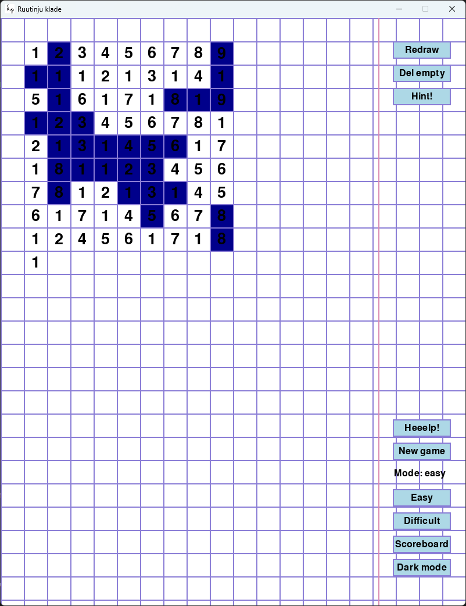

# Ruutinju klade (means "Notebook", just the checkered one)
I am trying to build a numbers game that I used to play on paper while being bored in university. I don't remember who taught it to me. Anyway, credit to that guy (I'm 99% sure it was a guy).
Rules are in the help button when you play the game or in the code.
If I have time, I'll create this as an .exe as well, now I can't be bothered.

Run ciparinji.py to run the game.

#game #notebook #killingtime #boredinuniversity

---

## Game rules

**Goal**  
Clear the board by removing every number so that the sum of all remaining numbers is 0.

**Board**  
- Starts as a 3×9 grid:
  - `1 2 3 4 5 6 7 8 9`  
  - `1 1 1 2 1 3 1 4 1`  
  - `5 1 6 1 7 1 8 1 9`

**Removing numbers**  
- Click two cells. They are removed together if:
  - Their values are **equal**, or  
  - Their values **sum to 10**, and  
  - They are **adjacent in reading order**: in left‑to‑right, top‑to‑bottom order, there are no other non‑zero numbers between them.

**Turns, Redraw, and Del empty**  
- You can remove as many valid pairs as you want in a “round”.  
- When you press **Redraw**, remaining numbers are repacked and this **increments the turn counter**.  
- When you press **Del empty**, fully empty rows are removed and this also **counts as a turn**.

**Difficulty modes**  
- **Easy mode**: you can redraw whenever you like.  
- **Hard mode**: you must use all available matches before you are allowed to redraw.  
- At the end of a game you enter **initials**, and your best hard‑mode results are saved to the scoreboard; full move histories are stored in `moves.json`.

**Other UI bits**  
- **Hint** highlights one valid pair (if any).  
- **Undo** reverts the last action (pair removal, redraw, or deleting empty rows).  
- **Mode** toggles between easy and hard before a game has started.

